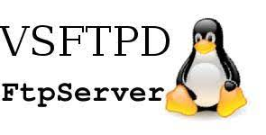

# Vsftpd Parser

<p align="center">
  
</p>

A simple python script to parse your Vsftpd log into ndjson format!
This will make your life easier in case you decide to use "json" module in the configuration file of your Logstash!

During a project we ran into a problem: parsing the vsftpd log input.
We looked for Filebeat or Logstash modules that would allow us to do this, but there aren't any.

We therefore decided to write our own parsing function

## Install dependencies

```pip3 install -r requirements.txt```

## How it works

By default this script takes the text from the vsftpd.log file present in /var/log/vsftpd.log and creates one in ndjson format called outputNdjson

If you want to read and write to specific folders use the following command:

```python3 parser.py -i <input.log> -o <output.ndjson>```

## Example

For example, the following line in vsftpd.log

```Wed Nov  3 15:22:10 2021 [pid 22844] CONNECT: Client "::ffff:82.59.13.178"
Wed Nov  3 15:22:19 2021 [pid 22841] [dakota] FAIL LOGIN: Client "::ffff:82.59.13.178"
Wed Nov  3 15:22:28 2021 [pid 22856] CONNECT: Client "::ffff:82.59.13.178"
Wed Nov  3 15:22:37 2021 [pid 22855] [dakota] FAIL LOGIN: Client "::ffff:82.59.13.178"
Wed Nov  3 15:22:40 2021 [pid 22858] CONNECT: Client "::ffff:82.59.13.178"
Wed Nov  3 15:22:43 2021 [pid 22857] [user] OK LOGIN: Client "::ffff:82.59.13.178"
Wed Nov  3 15:22:51 2021 [pid 22860] [user] OK DOWNLOAD: Client "::ffff:82.59.13.178", "/home/user/credentials.txt", 64 bytes, 0.25Kbyte/sec
```

will be parsed in ndjson format:

```
{"IP": "82.59.13.178", "Time": "2021-11-03T15:22:10", "Method": "Connect"}
{"IP": "82.59.13.178", "Time": "2021-11-03T15:22:19", "Method": "Fail Login"}
{"IP": "82.59.13.178", "Time": "2021-11-03T15:22:28", "Method": "Connect"}
{"IP": "82.59.13.178", "Time": "2021-11-03T15:22:37", "Method": "Fail Login"}
{"IP": "82.59.13.178", "Time": "2021-11-03T15:22:40", "Method": "Connect"}
{"IP": "82.59.13.178", "Time": "2021-11-03T15:22:43", "Method": "Ok Login"}
{"IP": "82.59.13.178", "Time": "2021-11-03T15:22:51", "Method": "Ok Download", "File": "/home/user/credentials.txt"
```

Cool, right?

## How to configure Logstash to parse this file

### CONFIG 1

This is a simple configuration to parse your logfile with json filter.

Copy the following [file](conf.d/logstash.conf) configuration in your ```/etc/logstash/conf.d/ftp.conf```.

Remember to change output with your real output!

### CONFIG 2

With [this configuration](conf.d/geolocalization.conf)  you can geolocate IP addresses

Remeber to copy the following [file](GeoLite2-City.mmdb) under /home/ubuntu/GeoIP


Enjoy your dashboard!
